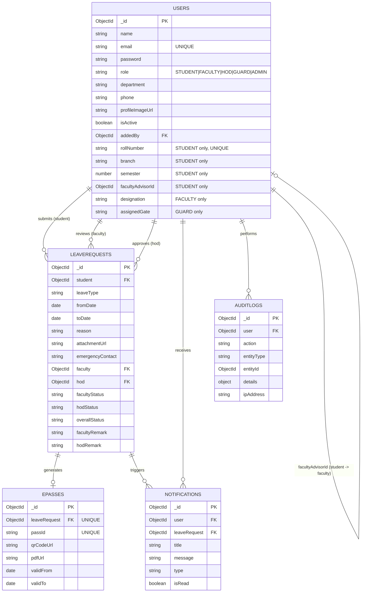

# E-PASS — Data Model Diagram (MongoDB)

MongoDB is document-based (no foreign-key joins), so this is a reference diagram of
collections and the ObjectId references between them. See `database/README.md` for full field
details.



## Roles (5 total)

| Role | Who creates this account | Purpose |
|---|---|---|
| STUDENT | Admin (or HOD, depending on your policy) | Applies for leave, views status, downloads E-Pass |
| FACULTY | Admin | First-level approval / rejection, forwards to HOD |
| HOD | **Admin only** | Final approval / rejection, department stats, triggers E-Pass |
| GUARD | Admin | Scans/verifies E-Pass QR codes at the gate |
| ADMIN | Bootstrapped automatically on first server start (see `.env` `DEFAULT_ADMIN_*`) | Full control — add/manage all members, see all stats |

## Workflow State Machine

```
Student applies  →  facultyStatus = Pending, hodStatus = Pending, overallStatus = Pending
Faculty approves →  facultyStatus = Approved        → forwarded to HOD
Faculty rejects  →  facultyStatus = Rejected, overallStatus = Rejected (terminal)
HOD approves     →  hodStatus = Approved, overallStatus = Approved → E-Pass generated
HOD rejects      →  hodStatus = Rejected, overallStatus = Rejected (terminal)
Guard scans QR   →  verifies pass validity at the gate (read-only, logged to auditlogs)
```
